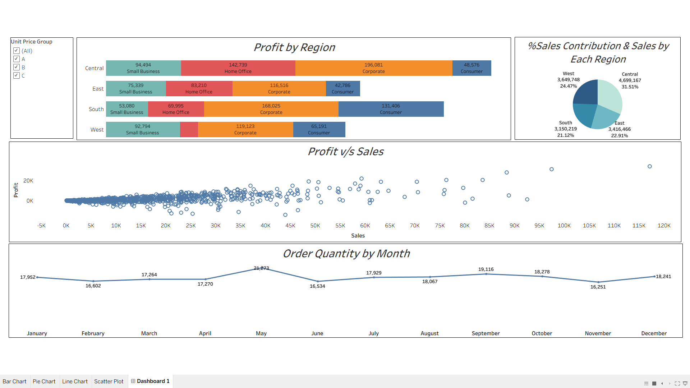
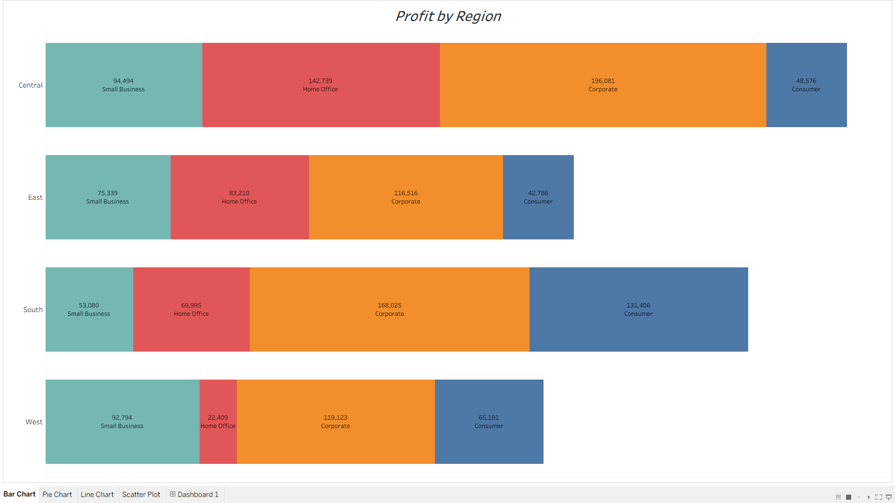
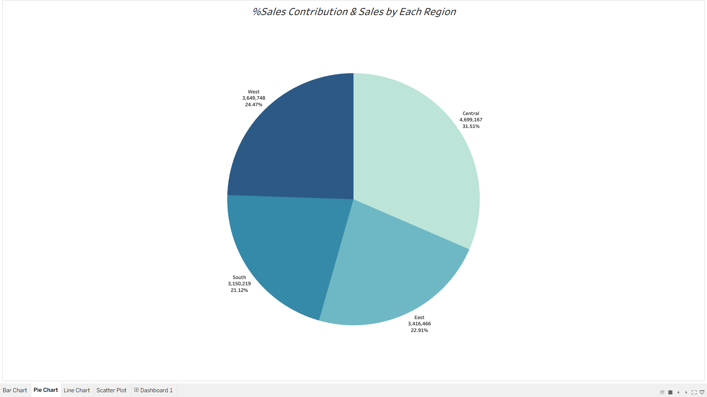
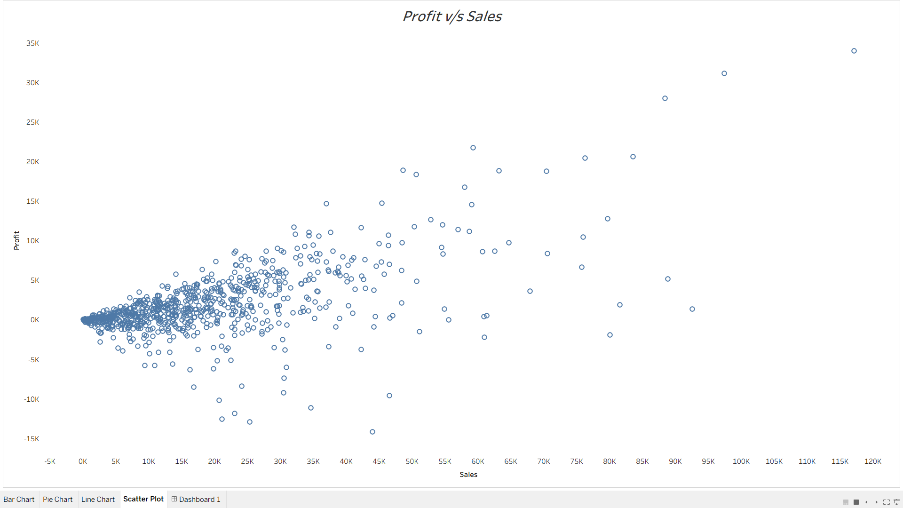

# Superstore Sales & Profitability Analysis - Tableau Dashboard

## Project Overview
This project leverages Tableau to analyze the sales performance and profitability of a retail superstore. By examining regional data, customer segments, and monthly trends, this dashboard provides actionable insights into which areas are driving revenue and which segments require cost optimization.

**[View the Interactive Dashboard on Tableau Public](https://public.tableau.com/app/profile/siddharth.singh7324/viz/Book1_17836766507660/Dashboard1?publish=yes)**

*(Note: Download the raw dataset used for this project from the repository files).*

---

## Executive Dashboard Summary
The final consolidated dashboard offers a high-level view of the store's performance, allowing stakeholders to filter and interact with the data to identify key business drivers.

---

## In-Depth Analysis & Visualizations

### 1. Profit Breakdown by Region & Segment
* **Visualization:** Stacked Bar Chart
* **Insights:** The **Corporate** segment is the most profitable across all four regions, generating a massive $196,081 in the Central region alone. Conversely, the **Consumer** segment yields the lowest profits, particularly in the East and Central regions, suggesting a need to re-evaluate pricing or marketing strategies for everyday consumers.

### 2. Regional Sales Contribution
* **Visualization:** Pie Chart
* **Insights:** The **Central region** is the powerhouse of the business, accounting for **31.51%** ($4.69M) of total sales. The West follows at 24.47%, while the East and South regions contribute roughly equal shares (~21-22%). 

### 3. Seasonality of Order Volumes
* **Visualization:** Line Chart
* **Insights:** Customer purchasing behavior shows distinct seasonal spikes. Order quantities peak significantly in **May (21,273 orders)** and experience a strong secondary surge in **September (19,116 orders)**. Inventory should be scaled up prior to these months to meet demand.

### 4. Profitability vs. Sales Volume Correlation
* **Visualization:** Scatter Plot
* **Insights:** While there is a general positive trend between higher sales and higher profits, the scatter plot highlights critical outliers. Several high-revenue orders (sales between $20K - $50K) actually resulted in **negative profit margins** (losses dropping below -$10K). These specific transactions need immediate auditing to understand underlying cost structures or heavy discounting issues.

---

## Tools & Technologies Used
* **Tableau Public / Desktop:** Data visualization, dashboard creation, interactive filtering.
* **Microsoft Excel:** Raw data storage and initial data familiarization.
* **Data Preparation:** Data extraction, field formatting, and calculated fields (if applicable).
